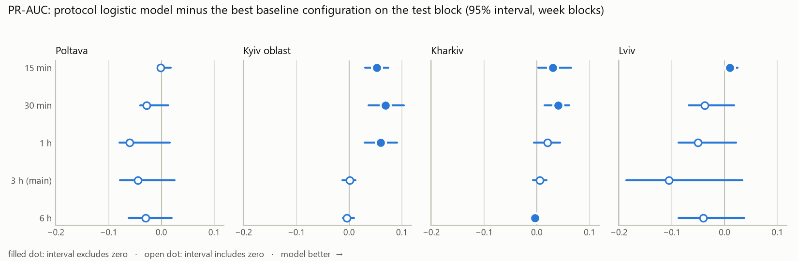
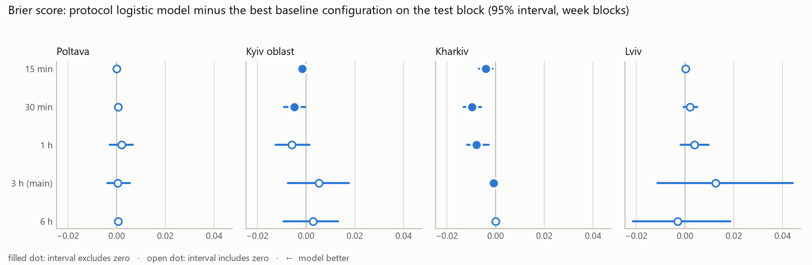
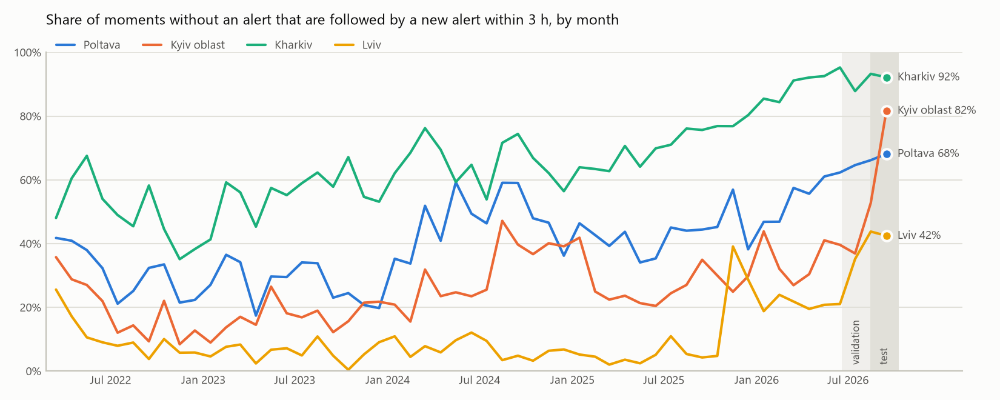

# alerts-forecast

Probabilistic forecast of **air-raid alert onsets in Ukrainian oblasts** (main: Poltava; for comparison: Kyiv oblast, Kharkiv
oblast, Lviv oblast), built as a mini-project for the KSE Agentic AI School selection. The point of the project is an honest,
leak-free evaluation, not a big number.

**Коротко українською.** Прогнозуємо ймовірність того, що в області *почнеться* тривога в найближчі 3 години (головний горизонт),
а також 1 і 6 годин; додатково 15 і 30 хвилин. Валідація лише walk-forward, оцінка на останніх 8 тижнях, інтервали бутстрепом
по тижнях. Кожна область оцінюється окремо, модель для звіту обирає протокол на валідації.
**Головний (запланований) висновок негативний: у Полтавській моделі не обігрують простий бейзлайн «частота тривог за останні дні»
на жодному горизонті.** Чесне застереження: висновок залежить від того, з чим порівнювати. Проти бейзлайна, обраного на валідації
(без підглядання в тест), у Полтавській є невеликий виграш у ранжуванні на 15 хв – 1 год (переважно бустинг); проти найкращої конфігурації
бейзлайну на самому тесті його немає. **Стійкий результат є в Київській (15 хв – 1 год) і Харківській (15–30 хв):** там моделі виграють
навіть проти найсуворішого еталона, саме там допомагають дані сусідніх областей, а при 1 год це повторюється й на попередньому періоді.
**Львівська:** стійкого результату немає, а сам ряд даних під сумнівом. Висновки кілька разів змінювались після перевірок, зокрема після
незалежної рецензії іншого агента; усе описано в [docs/decisions.md](docs/decisions.md). Тест на справді нових даних заздалегідь зареєстровано (рішення 9).

## Main results

Test block = last 8 weeks (2026-08-14 .. 2026-10-09, 57 Kyiv days, about 4,500 forecast moments per oblast and horizon).

- **Models** are the ones the protocol picks: for each oblast and horizon, the logistic family (feature set, with or without Platt scaling)
  and the boosting family with the best Brier on the validation block (8 weeks before the test block, purged by H).
- **Two references.** (1) *No hindsight*: the baseline family with the best validation Brier. (2) *Strict*: the best of all ~40 baseline
  **configurations on the test block itself**, separately for each metric. The strict one uses hindsight and is biased towards the baselines
  (a maximum over many candidates); it is a bound, not the truth. A claim below counts only if it holds against the strict reference.
- **Intervals**: 95%, paired, bootstrap over ISO weeks (9 blocks; coarse, but the alert rate persists for weeks, so day blocks were too narrow).

What survives the strict reference (logistic protocol model / boosting protocol model; † = interval excludes zero, see `results/summary.md` for every number):

| Oblast | 15 min | 30 min | 1 h | 3 h (main) |
|---|---|---|---|---|
| **Poltavska** (main) | nothing | nothing | nothing | nothing |
| Kyivska | PR-AUC † and Brier † / PR-AUC † | PR-AUC † and Brier † / PR-AUC † | PR-AUC † / PR-AUC † | nothing |
| Kharkivska | PR-AUC † and Brier † / both † | PR-AUC † and Brier † / both † | Brier † / both † | Brier † (tiny) / nothing |
| Lvivska (data warning) | PR-AUC † (tiny) / nothing | nothing | nothing | nothing |

<picture>
  <source media="(prefers-color-scheme: dark)" srcset="docs/figures/diff_pr_auc_dark.png">
  
</picture>

<picture>
  <source media="(prefers-color-scheme: dark)" srcset="docs/figures/diff_brier_dark.png">
  
</picture>

What this says, and what it does not:

- **Poltava (main oblast): no demonstrated gain** against the strict reference at any horizon, for either model. Against the no-hindsight reference
  there are small ranking gains at short horizons (15 min: logistic and boosting PR-AUC +0.021 †; 30 min and 1 h: boosting +0.042 † and +0.035 †), and none at 3 h.
  So the Poltava verdict depends on the reference; with hindsight a "rate of the last 3 days" baseline is as good as or better than the models.
- **Kyiv and Kharkiv: real gains at short horizons.** They hold against the strict reference, with the protocol models and with week blocks. The subset checks
  (without naive-affected moments, without the last 24 h; `results/*/robustness.txt`) were run at 1 h and 3 h and do not change the 1 h results. At 1 h the gains also
  repeat on the earlier period 2026-07-04..08-28 against the strict reference (Kyiv PR-AUC +0.057 †, Brier -0.0055 †; Kharkiv PR-AUC +0.062 †, Brier -0.0101 †).
  On the official source Kyiv points the same way without being significant (PR-AUC +0.021 [-0.009, +0.075]); for Kharkiv the official source is not usable.
- **Lviv: nothing robust**, and the Lviv series itself is questionable (see Data).
- **Probabilities (Brier) improve less often than ranking (PR-AUC)**, and boosting is not demonstrably better than logistic regression.
- **The hour of the week carries little usable signal in Poltava**, but real signal in Kharkiv, where it is the strongest baseline.

### Poltava in detail (test block; point values, intervals in `results/poltavska/`)

| Horizon | Model | Brier ↓ | PR-AUC ↑ |
|---|---|---|---|
| **H = 1 h** (30.0% positive) | constant rate (static, 90 d) | 0.2106 | 0.271 |
| | recent activity ("alert ended in the last H hours") | 0.2108 | 0.285 |
| | hour of week | 0.2190 | 0.289 |
| | recent level, last 30 days (no-hindsight reference) | 0.2100 | 0.315 |
| | recent level, last 3 days (strict reference: best on the test block) | 0.2094 | 0.359 |
| | **protocol logistic** (own + neighbours, Platt) | 0.2114 | 0.299 |
| | logistic, all features (NOT the protocol choice; shown because earlier versions reported it) | 0.2095 | 0.336 |
| | **protocol boosting** (all features) | 0.2085 | 0.351 |
| **H = 3 h** (66.3% positive) | constant rate | 0.2243 | 0.658 |
| | hour of week | 0.2377 | 0.670 |
| | recent level, last 30 days (no-hindsight reference; also best by Brier on the test block) | 0.2233 | 0.686 |
| | recent level, last 3 days (best by PR-AUC on the test block; validation Brier 0.2335, so validation would never pick it) | 0.2246 | 0.734 |
| | **protocol logistic** (all features, Platt) | 0.2238 | 0.689 |
| | **protocol boosting** (all features) | 0.2260 | 0.676 |

## How the conclusion changed during the work (read this)

1. An earlier README said that at H=1 the models clearly beat the baselines in Poltava (PR-AUC +0.066 [0.034, 0.095]). The first baselines had static training
   windows; in Kyiv the alert rate jumps between validation and test (H=1: 16% to 40%), and a plain "rate of the last 14 days, refit daily" got most of the
   apparent gain. That baseline (`recent_level`, **post hoc**) was added for every oblast; the Poltava advantage disappeared. Withdrawn.
2. Because a reference chosen on validation can fail under a regime change, a strict reference chosen on the test block was added.
3. It was first chosen by Brier and also used for PR-AUC; in Poltava that produced a "PR-AUC gain" at 15 min that disappears against the PR-AUC-best baseline.
   Then the strict reference was chosen per metric.
4. **External review** (a second agent, every claim re-computed by me before acting, decision 10): the strict reference was still only the best baseline
   *family* (its configuration chosen on validation); the tables showed a logistic variant I had picked after seeing results instead of the protocol's choice;
   validation was not purged before the test block; day-block intervals were too narrow. All four are fixed now. Consequences: Kyiv 3 h and almost every Lviv gain
   disappeared (a tiny PR-AUC gain at 15 min remains); Kyiv and Kharkiv at short horizons survived; Poltava stayed negative.
5. Earlier still, a significant H=3 gain disappeared with a wider hyperparameter grid (decision 5).

## Additional short horizons: 15 and 30 minutes

Added because at H = 3 h the target is close to saturated (66% of moments in Poltava are positive). **Additional and exploratory**; the main horizon stays 3 h.

**Do neighbouring oblasts and country-wide activity help?** (the same model with and without them, week-block bootstrap; numbers in `results/summary.md`)

| Oblast | 15 min | 30 min | 1 h | 3 h |
|---|---|---|---|---|
| Poltavska | logistic no; boosting PR-AUC +0.013 † (borderline) | boosting only (PR-AUC +0.036 †, Brier †) | boosting only (PR-AUC +0.051 †, Brier †) | no |
| Kyivska | **yes**, both models, both metrics (logistic PR-AUC +0.053 †) | **yes** (+0.070 †) | **yes** (+0.064 †, Brier -0.0150 †) | yes, smaller |
| Kharkivska | Brier † (both models), PR-AUC not significant | yes: logistic +0.032 †, Brier -0.0074 † | Brier † (both), boosting PR-AUC † | Brier † (tiny), logistic only |
| Lvivska | no | no | no | no |

- Where neighbours help, neighbours alone give almost all of it: for logistic regression "+ neighbours" and "+ neighbours + country" differ by at most 0.01 in PR-AUC.
- My advance expectation "strongest at 15 min" holds only partly: in Kyiv the gain peaks at 30 min - 1 h.
- **Lead time caveat:** at 15 min part of the signal is close to nowcasting: a wave already declared in a neighbouring oblast is visible at `t`.
  Legitimate (everything is known at `t`), but the warning comes at most 15 minutes ahead.
- Why nothing for Lviv: in the test block a neighbour's alert starts in the 2 minutes before Lviv's own start in only 2% of Lviv's alerts, in the 15 minutes before
  in 11% (Poltava: 17% and 64%). On top of that, Lviv's neighbour features rest largely on invented alert ends (see Data). An earlier README sentence ("in the west alerts
  are declared over large areas at once") is not supported by the test-block data and was removed.

## Planned untouched test (Monday 2026-10-12)

The test block above has been looked at many times. The only data nobody has seen arrives after the snapshot. The test is **pre-registered** in decision 9 of
`docs/decisions.md`, written before downloading: first compare the two snapshots for late additions; then evaluate the holdout (about 3 days) with exactly the
protocol above (validation = the 8 weeks before the holdout); primary question Poltava H=3 (prediction: no gain), secondary Kyiv and Kharkiv at 15 min - 1 h
(prediction: gains); 6-hour-block bootstrap; "inconclusive" unless an interval excludes zero; with about 3 days most cells are expected to be inconclusive.
The runner (`scripts/run_holdout.py`) is committed and tagged `holdout-freeze` before the download. Result: *to be added on Monday*.

## Task definition

- **Moment `t`**: every 15 minutes on the UTC clock. Only alerts with `started_at <= t` are known at `t`.
- **Target** `y_H(t) = 1` if a new alert **starts** in `(t, t + H]`, for `H` in {1, 3, 6} hours (main: 3), and additionally 15 and 30 minutes.
  A start exactly at `t` is the past.
- **Main sample**: only moments with **no alert active** at `t` (an alert is active if `started_at <= t < finished_at`; only the fact
  "not finished yet" is used, never the value of `finished_at`). On the other moments the plain "same as now" baseline would be trivial;
  instead the persistence baseline is "an alert ended within the last `H` hours".
- **End of data** = the latest timestamp anywhere in the file (2026-10-09 05:12:41 UTC); the last usable `t` is `end - H`.
- The positive rate is not stable: for Poltava H=3 it ranges 17-59% by month in 2022-2025 and 61-68% since May 2026 (`scripts/target_by_month.py --region ...`).
  In Kyiv oblast it jumps inside the evaluation blocks themselves, which is why static baselines were too weak there.

<picture>
  <source media="(prefers-color-scheme: dark)" srcset="docs/figures/positive_rate_by_month_dark.png">
  
</picture>

## Data

[Vadimkin/ukrainian-air-raid-sirens-dataset](https://github.com/Vadimkin/ukrainian-air-raid-sirens-dataset) (MIT), snapshot
`2f115548a8bd0816c901dbf422082091b3e5c34c` of 2026-10-09, pinned in `scripts/download_data.py`. Times are UTC (checked in the files).

- **Primary: the volunteer file** (eTryvoga channel, unofficial, oblast level for the whole period).
- **Invented ends (`naive`)**: when no end message was seen, the end is set to start + 30 min. 1.9% of Poltava alerts over the whole period, but 5.5% (21 of 382) in the
  test block; for Lviv's neighbours in the test block Rivne 27 of 107, Ternopil 9 of 21, Volyn 18 of 216. In real time such an end is not known. The sensitivity run
  removes moments that depend on an invented end of the *own* oblast only; neighbour and country features still use invented ends.
- **Check: the official file.** Since late 2025 it holds raion-level alerts only, ends 2026-09-07, has a hole at 2026-08-29..09-02, and every oblast-level row is
  duplicated. It is deduplicated and raions are merged into oblast episodes. Poltava and Kyiv agree with the volunteer file well (0% and 3% of volunteer starts
  outside any official episode, May - Aug 28). Kharkiv after merging is almost always "under alert" (386 moments without alert in the check period).
- **Lviv data warning:** 91% of volunteer alert starts in Lviv oblast (May - Aug 28) are not inside any official alert anywhere in the oblast (347 volunteer alerts
  against 30 official episodes). Different splitting of alerts cannot explain that; the Lviv series describes something the official data does not contain.
  Lviv is kept, with this warning (user's decision).
- **Choice of Lviv**: picked as a western oblast with fewer alerts than Poltava, using alert counts of the test block (a use of test-period information). It is the
  **most** active western oblast (Lviv 245, Volyn 216, Rivne 107, Khmelnytskyi 75, Chernivtsi 36, Ternopil 21, Ivano-Frankivsk 8, Zakarpattia 0 alerts in the test block),
  not the quietest one, as an earlier README wrongly said.
- **Late additions**: according to the external review, earlier snapshots miss 1-2 alerts that were added later (up to 14 days late, all naive). I have not verified this;
  the Monday holdout compares the snapshots first.
- Luhansk oblast is excluded from country-wide counts (permanent siren, not a series). Crimea is not in the data.
- Raw data is not stored in the repository: `python scripts/download_data.py`.

## Leakage controls

- **Truncation test** (`src/alerts_forecast/leakage.py`, `tests/test_leakage.py`, `tests/test_features.py`): for random moments and for the nasty ones (exactly at
  starts and ends of alerts), cut the data at `t` (drop later alerts, hide ends after `t`), recompute the features and require identical values. It runs on synthetic
  data and on the real data for all four oblasts, over all regions at once, and it is shown to **catch** a deliberately leaky feature ("minutes until the alert ends").
  It tests the feature functions on the final snapshot, not the whole pipeline and not what was available in real time.
- **Purges**: training rows need `t + H <= start of the block they predict`; validation rows need `t + H <= start of the test block` (added after the review).
- Features are built on the grid of the shortest horizon and every row must have them (`join_features` refuses missing values; boosting would otherwise accept them silently).
- Scalers and all fitted parameters use training rows only; tests check that predictions do not change when test labels are flipped.
- Local time (Kyiv, with summer time) is used for calendar features only; everything else is UTC.
- **Not covered** (so "leak-free" holds only with respect to the final snapshot): invented ends of other oblasts in the features, and late additions to the dataset.

## Validation protocol

- Test block: last 8 weeks. Validation block: the 8 weeks before, ending H before the test block. Weekly walk-forward blocks, refit every week
  (the `recent_level` baseline: every day).
- Each oblast is run completely **separately**: its own neighbour list, its own hyperparameters chosen on its own validation block, its own references.
- For every model family a small grid is searched (training window all/365/180/90 days; `k` of the smoothing; `C` of the regression; depth and iterations of boosting;
  window of the recent level 3/7/14/30 days). The best configuration of each family is chosen by **Brier on the validation block**. The reported models are the
  logistic and boosting families with the best validation Brier.
- References: "as now" (persistence, adapted as above), "mean by hour of week" (both required by the task), a constant rate, and two **post-hoc** baselines
  (smoothed hour of week; recent level). No-hindsight reference: the best baseline family on validation. Strict reference: the best baseline configuration on the
  test block, per metric.
- Uncertainty: bootstrap over ISO weeks of the Kyiv calendar (1000 draws, fixed seed), also for paired differences.
- Metrics: PR-AUC, Brier score, reliability table and calibration slope/intercept (slopes of step-wise constant baselines are meaningless).

## Features (`src/alerts_forecast/features.py`)

- Own history: time since the last alert ended, starts in the last 3 h / 24 h / 7 d, share of the last 24 h under alert, Kyiv time of day, weekend.
- Neighbouring oblasts: active flags, starts in the last 1 h / 3 h, time since their latest start. The lists come from my knowledge of the map, not from the data
  (`NEIGHBORS_BY_REGION`): Poltava (Chernihiv, Sumy, Kharkiv, Dnipropetrovsk, Kirovohrad, Cherkasy, Kyiv oblast), Kyiv oblast (Zhytomyr, Chernihiv, Poltava, Cherkasy,
  Vinnytsia, Kyiv City), Kharkiv (Sumy, Poltava, Dnipropetrovsk, Donetsk), Lviv (Volyn, Rivne, Ternopil, Ivano-Frankivsk, Zakarpattia).
- Country-wide: number of oblasts under alert, starts in the last 1 h / 3 h / 24 h.
- There is no "rate of the last few days" feature, and the models are refit weekly. Against a daily-refit 3-day baseline this is a handicap (see Limitations).

## Limitations (please read)

- **The test block is not untouched.** Decisions taken after looking at it: the smoothed hour-of-week baseline, the recent-level baseline, the strict reference and its
  three refinements (per metric, per configuration), the choice of Lviv (by test-block alert counts), the 15/30-minute horizons (after seeing the saturation at 3 h),
  and, until the review, the reported logistic variant. Boosting and the short horizons were run with the question written down before the run. The Monday holdout is
  the only clean test.
- **Asymmetry against the models.** The recent-level baseline is refit daily, the models weekly, and the models have no multi-day rate feature. For claims of a gain this is
  conservative; for the negative Poltava claim it is **not**: part of "the models do not beat the baseline" may be this handicap.
- **Intervals**: 9 weekly blocks give coarse intervals; the strict reference is chosen once on the full test block, not inside each bootstrap draw; many comparisons
  (4 oblasts x 5 horizons x several pairs x 2 metrics) and no correction, so about 1 in 20 intervals excludes zero by chance. The stronger evidence is consistency
  across horizons, metrics, subsets and periods, as in Kyiv and Kharkiv.
- For the logistic regression the best `C` is often the smallest of the grid: validation keeps asking for predictions close to a simple rate.
- The volunteer file is unofficial; Lviv in particular disagrees with the official data (see Data). Invented ends enter the neighbour features; late additions are not modelled.
- Neighbour lists are from memory of the map.

## How to reproduce

Python 3.12, tested on Windows 11.

```bash
python -m venv .venv
.venv\Scripts\activate            # Linux/macOS: source .venv/bin/activate
pip install -r requirements.txt
python scripts/download_data.py   # about 40 MB, pinned snapshot, sizes are checked
python -m pytest                  # about 2 minutes
bash scripts/run_region.sh "Poltavska oblast"   # experiment + robustness + boosting + short horizons for one oblast, roughly 25 minutes
bash scripts/run_region.sh "Kyivska oblast"     # also: Kharkivska oblast, Lvivska oblast
python scripts/summarize_regions.py             # builds results/summary.md from the saved outputs
python scripts/make_figures.py                  # README figures (light and dark) into docs/figures/
python scripts/run_holdout.py --simulate-days 3 # dry run of the holdout test on already seen data (code check only)
```

The Monday holdout: `python scripts/download_data.py --new-snapshot`, then `python scripts/run_holdout.py --new data/holdout/volunteer_data_en.csv`.
Results are deterministic (fixed seeds). The outputs of the runs used in this README are in `results/<oblast>/`.

## Layout

| Path | Content |
|---|---|
| `src/alerts_forecast/data.py` | loading, validation, official file as oblast episodes |
| `src/alerts_forecast/target.py` | 15-minute grid, state at `t`, onset label, main sample |
| `src/alerts_forecast/features.py` | own, neighbour and country features; neighbour lists |
| `src/alerts_forecast/baselines.py`, `models.py` | baselines, logistic regression, Platt scaling, boosting |
| `src/alerts_forecast/walkforward.py`, `experiment.py` | folds with purges, grids, validation-based choice, references, feature grid check |
| `src/alerts_forecast/metrics.py`, `leakage.py` | PR-AUC, Brier, calibration, block bootstrap; truncation check |
| `scripts/` | download, per-oblast runner, experiment/robustness/boosting runners, holdout runner, summary, figures; `run_baselines.py` is the first baseline-only run (decision 3) |
| `tests/` | unit tests, including the leakage checks |
| `results/<oblast>/` | `experiment.txt`, `boosting.txt`, `robustness.txt` (main horizons), `experiment_short.txt`, `boosting_short.txt` (15/30 min) |
| `results/summary.md` | all headline tables, generated from the files above; `poltavska/experiment_v1_narrow_grid_superseded.txt` is an old, withdrawn run |
| `docs/decisions.md` | decision log: options, choices, risks, mistakes, retractions, the review and the holdout pre-registration |
| `docs/figures/` | README figures, made by `scripts/make_figures.py` from the data and the saved results |

## License

Code: MIT (see `LICENSE`). The data keeps the license of its source repository (MIT) and is not redistributed here.

## Process and AI use

The project was built with Claude Code (Claude Sonnet 5.5, in the last steps Claude Opus 5.5) as the main engineering tool, step by step: plan, data checks,
target and grid, leakage tests, baselines, features, models, robustness, more oblasts, short horizons. A second agent then reviewed the repository; its claims were
re-computed before any change, almost all were confirmed, and the fixes are listed in decision 10. The decision log records, for each step, what was proposed,
what was checked in the data, what was wrong and how it was corrected. The full dialogue is submitted separately.

## Possible extensions

- A "rate of the last 3 days" feature and daily refits for the models (would remove the asymmetry; deliberately not done after seeing the test).
- A later data snapshot as a really untouched test block (planned, see above), and real-time vintages of the dataset to model late additions.
- More oblasts with the same pipeline (add the neighbour list to `NEIGHBORS_BY_REGION`, then `scripts/run_region.sh`).
- News, official statements and public Telegram channels, only items published before the forecast moment.
- Choosing configurations by PR-AUC or by a combination instead of Brier alone.
